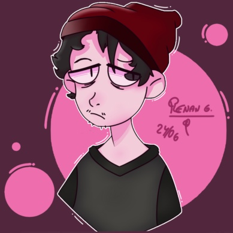

<h1 align="center" color="#0000ff" >Hi, I'm Renan Gonçalves</a>!</h1>

<h1 align="center">Welcome to my GitHub profile!</h1>

  
   <h1 style="text-size: 20%"> I'm Game Developer and Front-End Developer! <h1>

  
  
  
  
  
  

 

  
  
  
  
   
  
  

  

 
 

